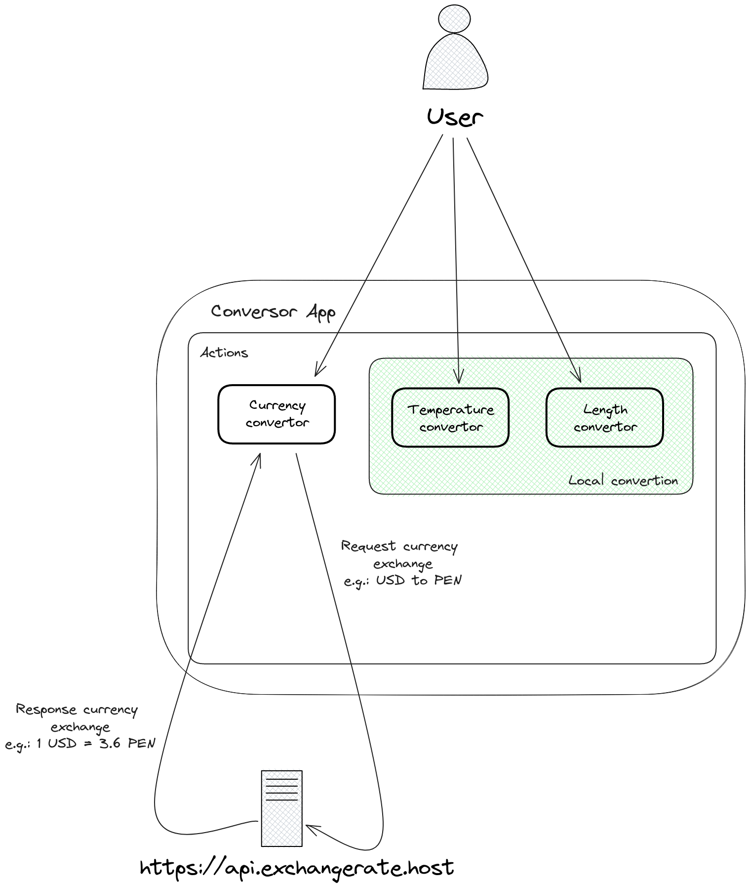
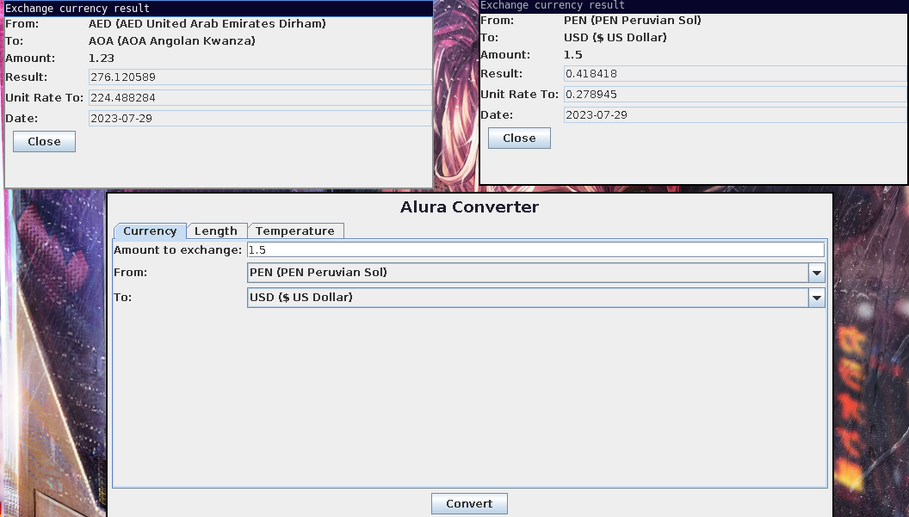
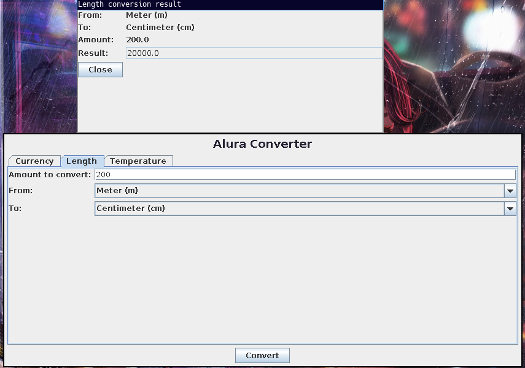
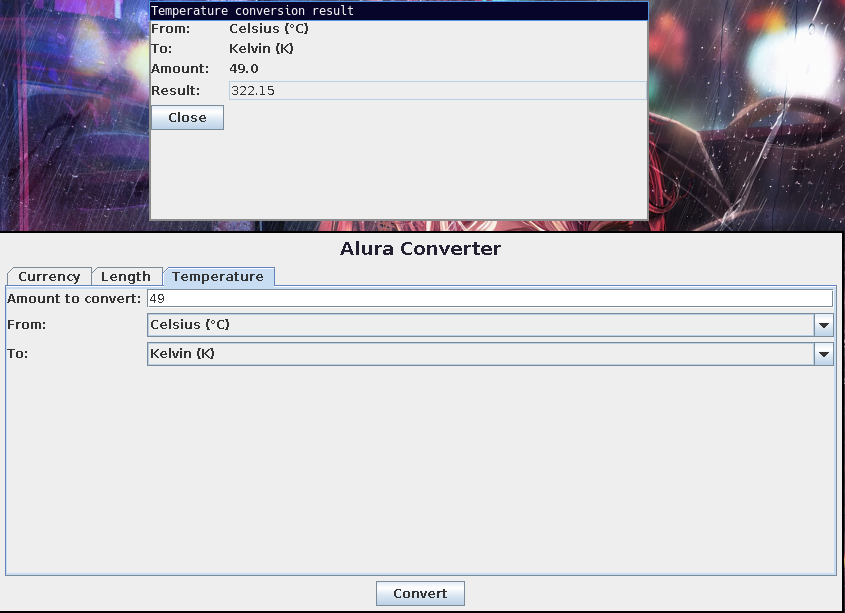

# Currency Converter App
An application for convert different currencies between them in
real time! In addition, you can convert temperature and length units too.

> NOTE: This project is a challengue from `Oracle One Next Education`.

## Table of Contents
* [Architecture](#architecture)
* [Technologies Used](#technologies-used)
* [Concepts Implemented](#technologies-used)
* [Features](#features)
* [Screenshots](#screenshots)
* [Setup](#setup)
* [Room for Improvement](#room-for-improvement)
* [Acknowledgements](#acknowledgements)

## Architecture
The defined architecture was the following:

## Technologies Used
- Java 11
- Maven 3.9.3

### Maven dependencies
- Jackson Databind (Manipulate JSON data)

## Concepts Implemented

### Java
- OOP (Oriented Objects Programming)
- Pholymorfism
- Enums

### Design Patterns
- Builder - Implemented to create result forms for the conversion.

## Features
- Exchange currencies in real time!
- Length unit converter
- Temperature converter

## Screenshots

## Setup
You can setup of 2 ways:
> For both cases you need Java 11 (JRE) to run.

### Jar

#### Steps
1. Download the latest release.
2. Execute: `java -jar downloaded.jar`

### Build

#### Requirements
- You need Maven (3.9.3 especially)

#### Steps
1. Go to root project.
2. Execute the following: `mvn clean install`.
3. An folder called `target` it would be generated.
4. Go to folder.
5. Execute the jar with dependencies description:
`java -jar alura-currency-converter-VERSION-jar-with-dependencies.jar`

## Room for Improvement
Well, it can be more amazing.

- Improve GUI (Yeah it's terrible but I'm backend, okno).
- Add execeptions when the user has no internet.

## Acknowledgements
Thanks to [Alura](https://github.com/alura-cursos) and 
[Oracle](https://github.com/oracle) for this oportunitty.
